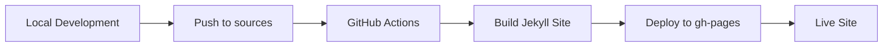

# SimpleBlog — Mark Hazleton's Personal Jekyll Site

[](https://github.com/markhazleton/markhazleton.github.io/actions/workflows/jekyll.yml)
[](https://www.ruby-lang.org/)
[](https://jekyllrb.com/)
[](https://opensource.org/licenses/MIT)

**Live Site**: [https://simpleblog.makeboldspark.com](https://simpleblog.makeboldspark.com)

## About

SimpleBlog is Mark Hazleton's personal website built with Jekyll and hosted on GitHub Pages. The site uses a customized Minima theme with custom layouts, includes, and CSS. Features include a dark/light mode toggle, emoji support, and modern styling without external frameworks.

> Built by [Mark Hazleton](https://markhazleton.com) — Mark Hazleton, Solutions Architect
> SimpleBlog is part of the [Make Bold Spark](https://makeboldspark.com) portfolio of technical demonstrations.

## 🚀 Quick Start

### Prerequisites

- Ruby 3.2.2 or higher
- Bundler gem (latest)
- Git
- Windows: Recommended for development (wdm gem included)

### Local Development Setup

1. **Clone the repository**
   ```bash
   git clone https://github.com/markhazleton/markhazleton.github.io.git
   cd markhazleton.github.io
   ```

2. **Install dependencies**
   ```bash
   bundle install
   ```

3. **Run the development server**
   ```bash
   bundle exec jekyll serve --livereload
   ```

4. **View the site**
   Open [http://localhost:4000](http://localhost:4000) in your browser

The site will automatically reload when you make changes to files.

## ✍️ Creating and Publishing Posts

### 1. Create a New Post

Posts are stored in the `_posts` directory and must follow the naming convention:
```
YYYY-MM-DD-title-of-post.markdown
```

**Example filename:** `2025-07-24-my-awesome-post.markdown`

### 2. Post Structure

Create a new file with the following front matter template:

```markdown
---
layout: post
title: "Your Compelling Post Title"
date: 2025-07-24 10:00:00 +0000
categories: [category1, category2]
tags: [tag1, tag2, tag3]
author: Mark Hazleton
excerpt: "A brief description that appears in post previews and SEO"
---

Your compelling content goes here. Use Markdown for formatting.

## Subheadings

- Bullet points
- Are supported

### Code Examples

```javascript
function hello() {
    console.log("Hello, World!");
}
```

**Bold text** and *italic text* work as expected.

[Links](https://example.com) are also supported.
```

### 3. Best Practices for Posts

#### Content Guidelines
- **Write compelling titles** that accurately describe your content
- **Use descriptive excerpts** (150-160 characters) for better SEO
- **Structure content** with proper headings (H2, H3, etc.)
- **Include relevant tags and categories** for better organization
- **Add code syntax highlighting** when sharing code snippets
- **Optimize images** and use descriptive alt text

#### SEO Optimization
- Use the `excerpt` field for meta descriptions
- Include relevant keywords naturally in your content
- Use proper heading hierarchy (H1 → H2 → H3)
- Add meaningful alt text to images
- Internal and external linking for context

#### Front Matter Options
```yaml
---
layout: post                    # Always use 'post' for blog posts
title: "Your Post Title"        # Required: SEO and display title
date: YYYY-MM-DD HH:MM:SS +0000 # Required: Publication date/time
categories: [updates, tech]     # Optional: Broad categorization
tags: [jekyll, github, coding]  # Optional: Specific topics
author: Mark Hazleton          # Optional: Author name
excerpt: "Brief description"    # Optional: Custom excerpt for SEO
image: /assets/images/post.jpg  # Optional: Featured image
comments: true                  # Optional: Enable/disable comments (default: true)
---
```

### 4. Publishing Workflow

#### Option A: Direct to Main Branch (Recommended for quick updates)
```bash
# 1. Create your post file
touch _posts/2025-07-24-your-post-title.markdown

# 2. Write your content
# Edit the file with your preferred editor

# 3. Preview locally
bundle exec jekyll serve --livereload

# 4. Commit and push
git add _posts/2025-07-24-your-post-title.markdown
git commit -m "Add new post: Your Post Title"
git push origin sources
```

#### Option B: Feature Branch Workflow (Recommended for major content)
```bash
# 1. Create a new branch
git checkout -b post/your-post-title

# 2. Create and write your post
touch _posts/2025-07-24-your-post-title.markdown
# Edit the file

# 3. Test locally
bundle exec jekyll serve --livereload

# 4. Commit changes
git add _posts/2025-07-24-your-post-title.markdown
git commit -m "Add new post: Your Post Title"

# 5. Push and create pull request
git push origin post/your-post-title
# Create PR via GitHub interface

# 6. After review, merge to sources branch
```

### 5. Automated Deployment

The site uses GitHub Actions for automated deployment:
- **Trigger**: Push to `sources` branch
- **Build**: Ruby 3.2, Jekyll 4.3+
- **Deploy**: GitHub Pages
- **URL**: https://markhazleton.com

Check deployment status at: [Actions tab](https://github.com/markhazleton/markhazleton.github.io/actions)

## 🛠️ Local Development

### System Requirements

| Component | Version | Purpose |
|-----------|---------|---------|
| Ruby | 3.2.2+ | Jekyll runtime |
| Bundler | Latest | Dependency management |
| Git | Latest | Version control |
| Jekyll | 3.10.0 | Static site generator (via github-pages gem) |

### Development Environment Setup

#### macOS Setup
```bash
# Install Ruby via Homebrew (recommended)
brew install ruby

# Add Ruby to PATH
echo 'export PATH="/opt/homebrew/opt/ruby/bin:$PATH"' >> ~/.zshrc
source ~/.zshrc

# Install Bundler
gem install bundler

# Verify installation
ruby --version  # Should be 3.2+
bundle --version
```

#### Windows Setup
```powershell
# Install Ruby using RubyInstaller
# Download from: https://rubyinstaller.org/
# Choose Ruby+Devkit 3.2.x (x64)

# Install Bundler
gem install bundler

# Verify installation
ruby --version
bundle --version
```

#### Linux (Ubuntu/Debian) Setup
```bash
# Install Ruby and development tools
sudo apt update
sudo apt install ruby-full build-essential zlib1g-dev

# Configure gem installation directory
echo '# Install Ruby Gems to ~/gems' >> ~/.bashrc
echo 'export GEM_HOME="$HOME/gems"' >> ~/.bashrc
echo 'export PATH="$HOME/gems/bin:$PATH"' >> ~/.bashrc
source ~/.bashrc

# Install Bundler
gem install bundler
```

### Running the Site Locally

#### Basic Development Server
```bash
# Standard development server
bundle exec jekyll serve

# With live reload (recommended)
bundle exec jekyll serve --livereload

# With drafts enabled
bundle exec jekyll serve --livereload --drafts

# Custom port
bundle exec jekyll serve --port 4001

# Production-like build
JEKYLL_ENV=production bundle exec jekyll serve
```

#### Development Server Options

| Flag | Purpose |
|------|---------|
| `--livereload` | Auto-refresh browser on changes |
| `--drafts` | Include posts from `_drafts` folder |
| `--future` | Show posts with future dates |
| `--port 4001` | Use custom port |
| `--host 0.0.0.0` | Allow external connections |
| `--incremental` | Faster builds (experimental) |

### Project Structure

```
markhazleton.github.io/
├── _config.yml              # Site configuration
├── _posts/                  # Blog posts
│   └── YYYY-MM-DD-title.md
├── _drafts/                 # Draft posts (not published)
├── _layouts/                # Page templates
│   ├── default.html
│   ├── home.html
│   ├── page.html
│   └── post.html
├── _includes/               # Reusable components
│   ├── header.html
│   ├── footer.html
│   └── head.html
├── _sass/                   # Sass stylesheets
│   └── minima/
├── assets/                  # Static assets
│   ├── main.scss
│   └── images/
├── .github/
│   └── workflows/
│       └── jekyll.yml       # GitHub Actions deployment
├── Gemfile                  # Ruby dependencies
├── Gemfile.lock            # Locked dependency versions
└── README.md               # This file
```

### Configuration

The site configuration is managed in `_config.yml`:

```yaml
# Site Identity
title: Mark Hazleton
description: Solutions Architect | Technology Leader | Lifelong Learner
baseurl: "/"
url: "https://markhazleton.com"
author:
  name: Mark Hazleton
  email: ""  # Intentionally blank for privacy

# Build Settings
theme: null            # Not using theme gem
remote_theme: null     # Custom implementation
plugins:
  - jekyll-feed        # RSS feed generation
  - jemoji            # GitHub-style emoji support
  - jekyll-sitemap    # XML sitemap generation
  - jekyll-seo-tag    # SEO meta tags

# Theme Settings
minima:
  skin: auto          # Responsive to system preference
  social_links:
    twitter: markhazleton
    github: markhazleton
    linkedin: markhazleton
    stackoverflow: "479571"

# Sass
sass:
  style: compressed   # Production optimization
```

## 🚀 Deployment & Publishing

### GitHub Pages Deployment

This site is automatically deployed to GitHub Pages using GitHub Actions:

1. **Source Branch**: `sources` (development branch)
2. **Deployment Branch**: `gh-pages` (auto-generated, never commit directly)
3. **Live URL**: https://markhazleton.com
4. **Jekyll Version**: 3.10.0 (via github-pages gem for compatibility)

### Deployment Workflow



### Manual Deployment (if needed)

```bash
# Build the site locally
JEKYLL_ENV=production bundle exec jekyll build

# The built site will be in _site/ directory
# This is automatically handled by GitHub Actions
```

## 📝 Content Management

### Writing Drafts

Drafts are stored in the `_drafts` folder and won't be published:

```bash
# Create a draft (no date in filename)
touch _drafts/my-draft-post.md

# Preview drafts locally
bundle exec jekyll serve --drafts
```

### Managing Categories and Tags

#### Categories
Use categories for broad content groupings:
- `updates` - Site updates and announcements
- `tech` - Technical posts
- `projects` - Project showcases
- `thoughts` - Personal reflections

#### Tags
Use tags for specific topics:
- `jekyll`, `github-pages`, `web-development`
- `programming`, `javascript`, `python`
- `tutorial`, `guide`, `tips`

### Asset Management

#### Images
Store images in `assets/images/`:
```markdown

```

#### Optimize images before uploading:
- Use WebP format when possible
- Compress images (aim for <500KB)
- Use descriptive filenames
- Include alt text for accessibility

## 🔧 Customization

### Theme Customization

The site uses a customized Minima theme implementation with:
- Custom layouts in `_layouts/` (not from theme gem)
- Custom includes in `_includes/` for header, footer, head
- Dark/light mode toggle with localStorage persistence
- Emoji-based icons (via jemoji plugin)
- Custom CSS in `assets/css/style.css` with Bootstrap-inspired utilities
- Theme switcher JavaScript inline in header
- Social media integration via Minima configuration

### Adding Custom Styles

**Option 1:** Edit `assets/css/style.css` for standalone CSS:
```css
/* Add your custom styles */
.custom-class {
  color: #your-color;
}
```

**Option 2:** Edit `assets/main.scss` to add Sass:
```scss
---
---

@import "minima";

// Your custom Sass here
.custom-class {
  color: #your-color;
}
```

**Note:** Current implementation uses standalone CSS (`style.css`) with CSS custom properties, not generated from Sass.

### Custom Layouts

Create new layouts in `_layouts/`:
```html
---
layout: default
---

<article class="custom-layout">
  {{ content }}
</article>
```

### Adding Plugins

Add plugins to `_config.yml`:
```yaml
plugins:
  - jekyll-feed
  - jekyll-sitemap
  - jekyll-seo-tag
  - your-new-plugin
```

Then update `Gemfile`:
```ruby
gem "your-new-plugin"
```

Run `bundle install` to install new plugins.

## 🔧 Maintenance & Updates

### Keeping Dependencies Updated

Regular maintenance ensures security, performance, and compatibility:

#### Monthly Updates
```bash
# Update all gems
bundle update

# Check for outdated gems
bundle outdated

# Update specific gem
bundle update jekyll

# Verify site still works
bundle exec jekyll serve
```

#### Security Updates
```bash
# Check for security vulnerabilities
bundle audit

# Update specific vulnerable gems
bundle update gem-name
```

#### GitHub Pages Compatibility
```bash
# Check GitHub Pages gem versions
bundle exec github-pages versions

# Update to latest GitHub Pages compatible versions
bundle update

# Verify Jekyll version (should be 3.10.0 for GitHub Pages)
bundle exec jekyll --version
```

**Important:** The `github-pages` gem pins Jekyll to 3.10.0 and many other gems to specific versions. This ensures your local build matches GitHub's deployment environment exactly. Many gems will appear "outdated" in `bundle outdated` - this is intentional and correct.

### Performance Optimization

#### Image Optimization
- Use WebP format when possible
- Compress images before uploading
- Use responsive images with `srcset`
- Implement lazy loading for images

#### Build Optimization
- Enable Sass compression in `_config.yml`:
  ```yaml
  sass:
    style: compressed
  ```
- Minimize plugins to essential ones only
- Use Jekyll's built-in optimization features

### SEO Best Practices

#### Technical SEO
- XML sitemap (auto-generated)
- RSS feed (auto-generated)
- Proper meta tags via `jekyll-seo-tag`
- Clean URLs and permalink structure
- Fast loading times
- Mobile responsiveness

#### Content SEO
- Descriptive, keyword-rich titles
- Custom excerpts for meta descriptions
- Proper heading hierarchy (H1, H2, H3)
- Internal linking between posts
- Alt text for all images
- Schema markup (handled by SEO plugin)

### Accessibility Guidelines

- Use semantic HTML elements
- Provide alt text for images
- Ensure sufficient color contrast
- Make navigation keyboard accessible
- Use descriptive link text
- Test with screen readers

## 🤝 Contributing

### Contribution Guidelines

1. **Fork the repository**
2. **Create a feature branch**
   ```bash
   git checkout -b feature/your-feature-name
   ```
3. **Make your changes**
4. **Test locally**
   ```bash
   bundle exec jekyll serve --livereload
   ```
5. **Commit with descriptive messages**
   ```bash
   git commit -m "Add: Brief description of changes"
   ```
6. **Push and create pull request**
   ```bash
   git push origin feature/your-feature-name
   ```

### Commit Message Conventions

Use conventional commit format:
- `feat:` New features
- `fix:` Bug fixes
- `docs:` Documentation updates
- `style:` Code style changes
- `refactor:` Code refactoring
- `test:` Test additions/updates
- `chore:` Maintenance tasks

### Code Quality Standards

- Follow Jekyll best practices
- Use consistent indentation (2 spaces)
- Write clear, semantic HTML
- Use BEM methodology for CSS classes
- Test changes across different browsers
- Validate HTML and CSS

## 📊 Analytics & Monitoring

### Google Analytics Integration

GA4 tracking (Make Bold Spark, `G-RY77Z11S9E`) is active via `_includes/google-analytics.html`, included in every page through `_includes/head.html`.

### Performance Monitoring

Monitor site performance using:
- Google PageSpeed Insights
- GTmetrix
- Lighthouse (built into Chrome DevTools)
- WebPageTest

### Error Monitoring

- Check GitHub Actions for build failures
- Monitor 404 errors via Google Search Console
- Use browser developer tools for client-side errors

## 🔍 Troubleshooting

### Common Issues

#### Build Failures
```bash
# Clear Jekyll cache
bundle exec jekyll clean

# Rebuild from scratch
rm -rf _site .jekyll-cache
bundle exec jekyll build

# Check for syntax errors
bundle exec jekyll doctor
```

#### Dependency Issues
```bash
# Reset bundle
rm Gemfile.lock
bundle install

# Check Ruby version compatibility
rbenv versions  # or rvm list
```

#### Local Server Issues
```bash
# Kill processes using port 4000
lsof -ti:4000 | xargs kill

# Use different port
bundle exec jekyll serve --port 4001
```

### Getting Help

- [Jekyll Documentation](https://jekyllrb.com/docs/)
- [GitHub Pages Documentation](https://docs.github.com/en/pages)
- [Minima Theme Documentation](https://github.com/jekyll/minima)
- [Jekyll Community Forum](https://talk.jekyllrb.com/)

## 📄 License

This project is licensed under the MIT License - see the [LICENSE.txt](LICENSE.txt) file for details.

## 🙏 Acknowledgments

- [Jekyll](https://jekyllrb.com/) - Static site generator
- [Minima](https://github.com/jekyll/minima) - Base theme inspiration
- [GitHub Pages](https://pages.github.com/) - Hosting platform
- [GitHub Actions](https://github.com/features/actions) - CI/CD pipeline
- [jemoji](https://github.com/jekyll/jemoji) - Emoji support plugin
- [jekyll-seo-tag](https://github.com/jekyll/jekyll-seo-tag) - SEO optimization

---

## 📚 Additional Resources

### Learning Resources
- [Jekyll Step-by-Step Tutorial](https://jekyllrb.com/docs/step-by-step/01-setup/)
- [Markdown Guide](https://www.markdownguide.org/)
- [Git Handbook](https://guides.github.com/introduction/git-handbook/)
- [Liquid Template Language](https://shopify.github.io/liquid/)

### Tools & Extensions
- [VS Code Jekyll Snippets](https://marketplace.visualstudio.com/items?itemName=ginfuru.ginfuru-vscode-jekyll-syntax)
- [Markdown All in One](https://marketplace.visualstudio.com/items?itemName=yzhang.markdown-all-in-one)
- [Jekyll Post Generator](https://github.com/jekyll/jekyll-compose)

### Useful Commands Reference
```bash
# Quick reference for common Jekyll commands
bundle exec jekyll serve --livereload    # Development server with auto-reload
bundle exec jekyll build                 # Build site for production
bundle exec jekyll clean                 # Clean generated files
bundle exec jekyll doctor                # Check for issues
bundle exec jekyll new-theme theme-name  # Create new theme
bundle install                          # Install dependencies
bundle update                           # Update dependencies
bundle exec jekyll --version            # Check Jekyll version
```

---

*Last updated: January 2026*
